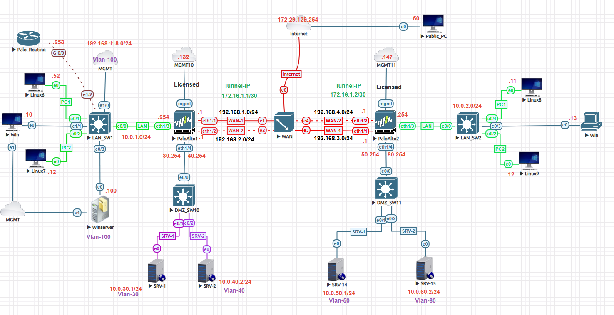
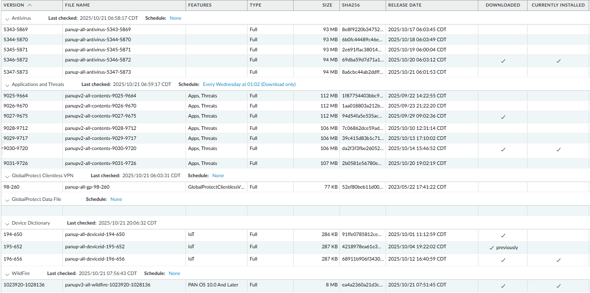
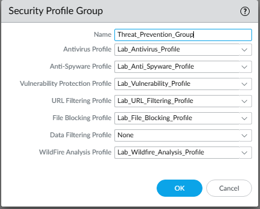
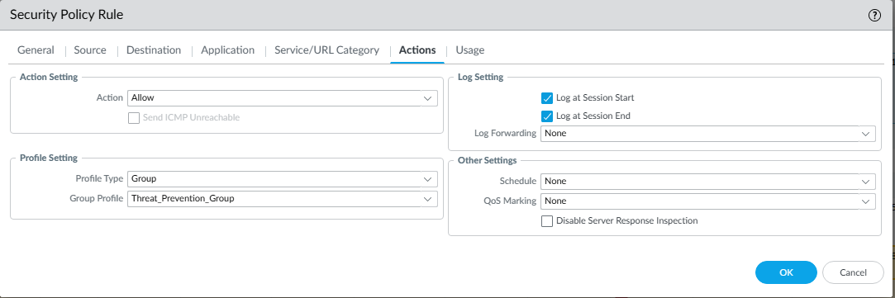
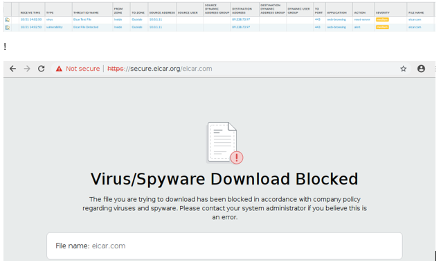
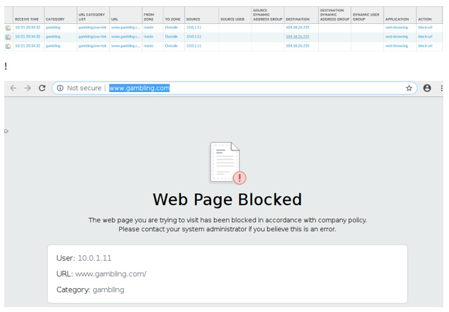

# 🛡️ Palo Alto Threat Prevention Lab

## 🎯 Objective
This lab demonstrates how to implement and verify **Palo Alto Networks Threat Prevention** features — including **Antivirus, Anti-Spyware, Vulnerability Protection, URL Filtering, File Blocking, and WildFire Analysis** — to detect and prevent malicious activity in real time.

The configuration also showcases the use of a **Security Profile Group** applied to a security policy to streamline enforcement.

---

## 🧩 Topology

  
🖼 *Screenshot:* `screenshots/palo-threat-prevention-topology.png`

> **Description:**  
> Outbound web and file traffic from the LAN (`10.0.1.0/24`) passes through the Palo Alto firewall’s **Trust (Inside)** zone, where the `Threat_Prevention_Group` security profiles inspect and filter malicious or restricted content before it reaches the **Untrust (Outside)** interface.

| Component | Role | IP / Network |
|------------|------|---------------|
| **Firewall (Trust / Inside)** | LAN Interface | `10.0.1.254/24` |
| **Firewall (Untrust / Outside)** | Internet Interface | `192.168.1.254/24` |
| **Firewall (Management)** | Management Interface | `192.168.118.132` |
| **Active Directory / DNS Server** | Domain Controller, internal test host | `10.0.1.100` |
| **LAN Network** | User subnet | `10.0.1.0/24` |
| **Security Profile Group** | Threat Prevention Bundle | `Threat_Prevention_Group` |

---

## ⚙️ Step 1: Verify Dynamic Updates
1. Navigate to **Device → Dynamic Updates**.  
2. Ensure the following are **downloaded and installed**:
   - Applications and Threats  
   - Antivirus  
   - WildFire  
   - URL Filtering Database  
3. Click **Check Now**, then **Download** and **Install** the latest versions.

  
🖼 *Screenshot:* `screenshots/dynamic-updates.png`

---

## ⚙️ Step 2: Create and Apply Threat Prevention Profiles and Group
1. Go to **Objects → Security Profiles → Security Profile Group → Add**  
2. Name the group: `Threat_Prevention_Group`
3. Add the following profiles (using customized or cloned defaults):  
   - **Antivirus:** `AV-Default`  
   - **Anti-Spyware:** `Spyware-Default`  
   - **Vulnerability Protection:** `Vuln-Default`  
   - **URL Filtering:** `URL-Filter`  
   - **File Blocking:** `File-Block`  
   - **WildFire Analysis:** `WildFire-Analysis`
4. Under **Policies → Security**, edit the following rules to attach the group:
   - `Inside_To_Outside`
   - `LAN_To_VPN`
   - `VPN_To_LAN`
5. On the **Actions** tab → **Profile Setting**, select `Group Profile` → `Threat_Prevention_Group`.
6. Click **Commit**.

  
🖼 *Screenshot:* `screenshots/threat-prevention-group.png`

  
🖼 *Screenshot:* `screenshots/security-policy-threat-prevention.png`

---

## 🧪 Step 3: Testing and Validation

### **1️⃣ Antivirus Test**
- From a LAN host (`10.0.1.100`), attempt to download the **EICAR test file**:  
  [https://secure.eicar.org/eicar.com](https://secure.eicar.org/eicar.com)  
- The firewall should block the download, generating a **Threat Log** entry.

  
🖼 *Screenshot:* `screenshots/eicar-block.png`

---

### **2️⃣ URL Filtering Test**
- From a LAN host, try visiting a **Gambling** or **Adult** website.  
- The browser should display a **block page**.  
- Confirm entries under **Monitor → URL Filtering**.

  
🖼 *Screenshot:* `screenshots/url-filter-block.png`

---

## ✅ Step 3: Verification & Monitoring

### **CLI Validation**
```bash
show running security-policy
show threat id #
show wildfire status
show wilfire status channel public/private
tail follow yes mp-log wildfire-upload-log
