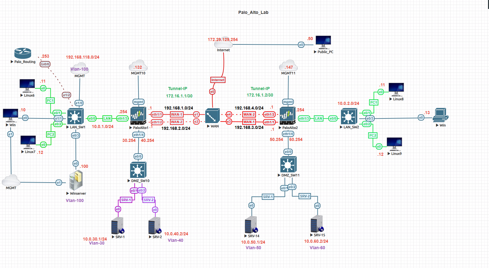
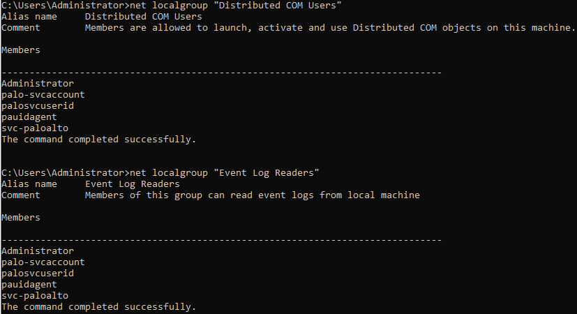
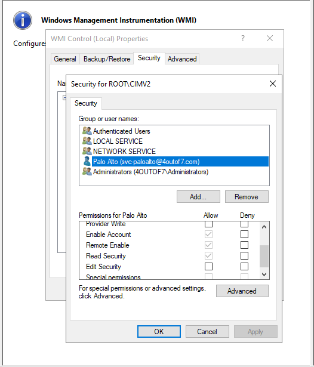
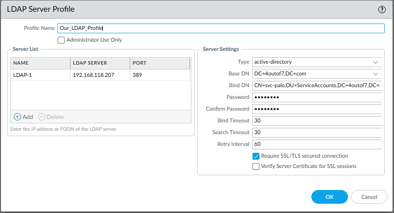
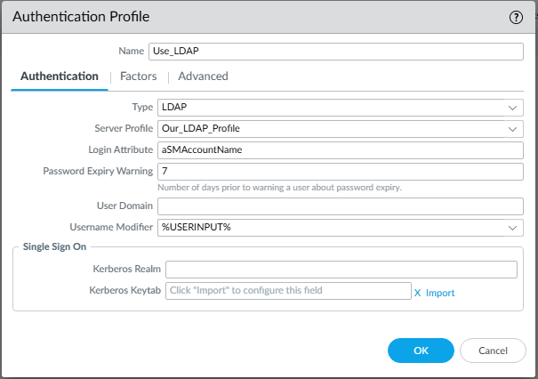
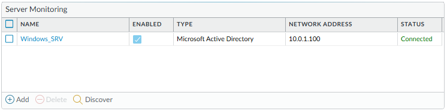

# Palo Alto User-ID Integration Lab

## 🎯 Objective
This lab demonstrates how to integrate a **Palo Alto Networks Firewall** with **Active Directory (AD)** using **User-ID Agentless Integration**.  
The goal is to map network traffic to specific AD user identities for user-based visibility, policy enforcement, and logging.

---

## 🧩 Topology


**Key Components**
- **Firewall:** 10.1.0.254 (Trust) / 192.168.1.254 (Untrust) / 192.168.118.188 (Mgmt)
- **Active Directory / Domain Controller:** 10.1.0.207 (AD, DNS, WMI)
- **Domain:** 4OUTOF7.COM
- **Service Account:** `svc-paloalto`
- **Objective:** Retrieve user mappings via WMI and monitor AD login events.

---

## ⚙️ Step 1: Create Service Account in Active Directory
1. On the AD server, create a dedicated service account:
   - **Username:** `svc-paloalto`
   - **Password:** Strong and set to never expire.
2. Add the account to the following local groups:
   - Distributed COM Users  
   - Event Log Readers  
   - Remote Management Users  



---

## 🧱 Step 2: Configure WMI Security
1. On the AD server:
   - Open **wmimgmt.msc** → Right-click **WMI Control (Local)** → **Properties**.
   - Under **Security**, expand **Root → CIMV2** → select **Security**.
2. Grant **Remote Enable** and **Execute Methods** permissions to `svc-paloalto`.



---

## 🔐 Step 3: Configure LDAP Server Profile
1. On the Palo Alto Firewall:
   - Go to **Device → Server Profiles → LDAP → Add**.
   - Name: `LDAP-Profile`
   - Type: `Active Directory`
   - Base DN: `dc=4OUTOF7,dc=com`
   - Bind DN: `svc-paloalto@4outof7.com`
   - Server: `10.1.0.207`
   - Port: `389`
   - Test connectivity to confirm successful bind.



---

## 🔑 Step 4: Configure Authentication Profile
1. Go to **Device → Authentication Profile → Add**.
2. Select **LDAP** as the authentication method.
3. Choose the previously created `LDAP-Profile`.
4. Add allowed users or groups (e.g., `Domain Users`).



---

## 🌐 Step 5: Enable User-ID on the Firewall
1. Go to **Device → User Identification → User Mapping**.
2. Check **Enable User Identification**.
3. Add the server (AD):
   - **Type:** WMI
   - **Server:** 10.1.0.207  
   - **Username:** 4OUTOF7\svc-paloalto
4. Click **OK**, then **Commit**.



---

## 🧠 Step 6: Verify Configuration
Run the following CLI commands to confirm connectivity and user mappings:

```bash
show user server-monitor state all
show user ip-user-mapping all

```
---

### 🔁 Lab Navigation

| ⬅ Previous | 🏠 Back to Index | Next ➡ |
|-------------|-----------------|---------|
| [← Site-to-Site VPN Lab](../palo-alto-site-to-site-vpn/) | [Network Security Labs](../index.md) | [GlobalProtect VPN Lab →](../palo-alto-globalprotect-lab/) |


